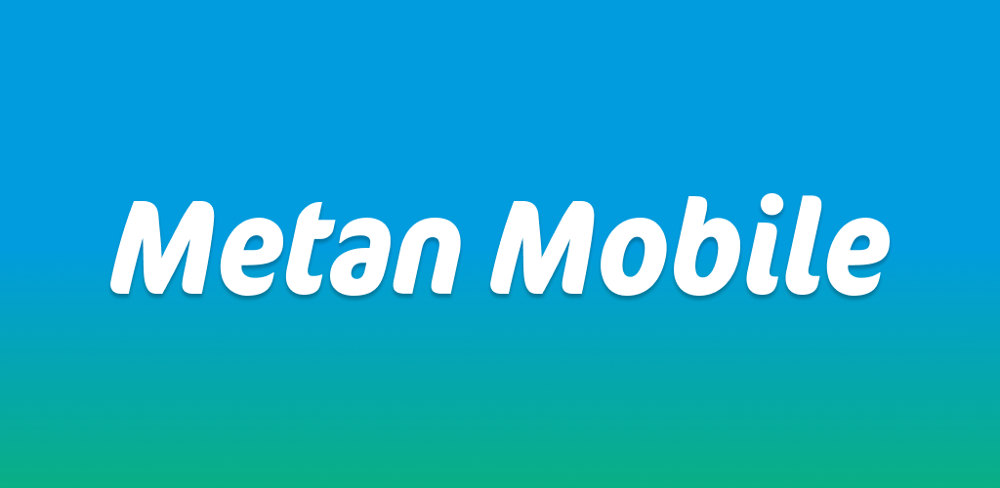
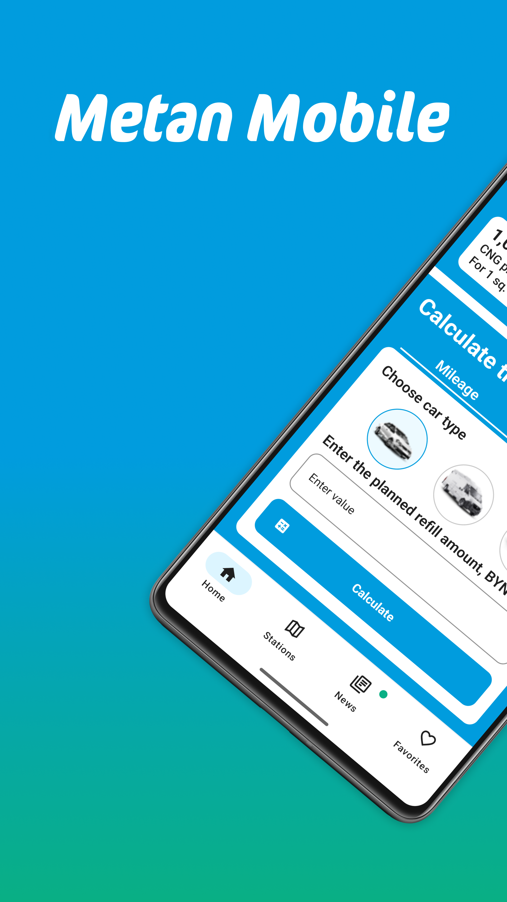
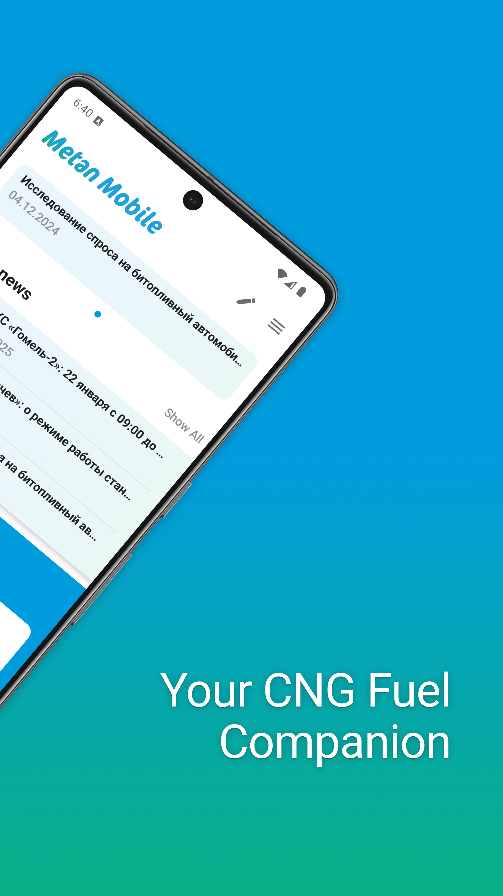
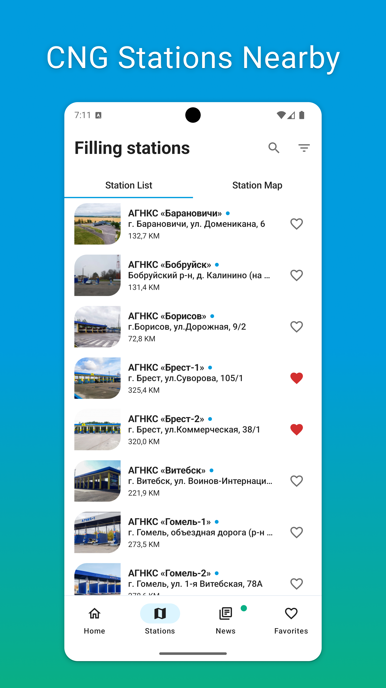
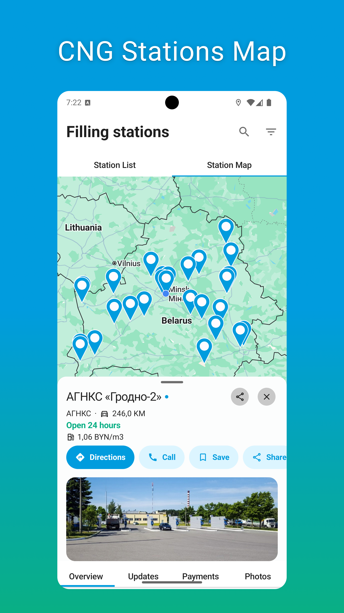
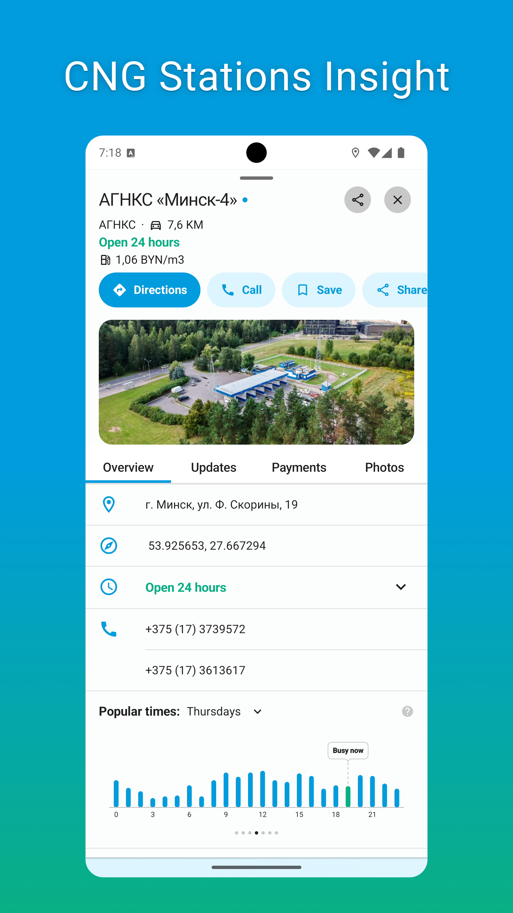
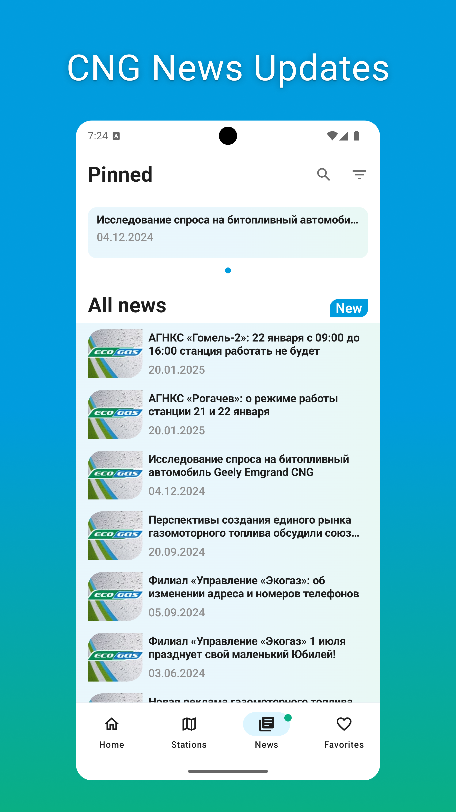
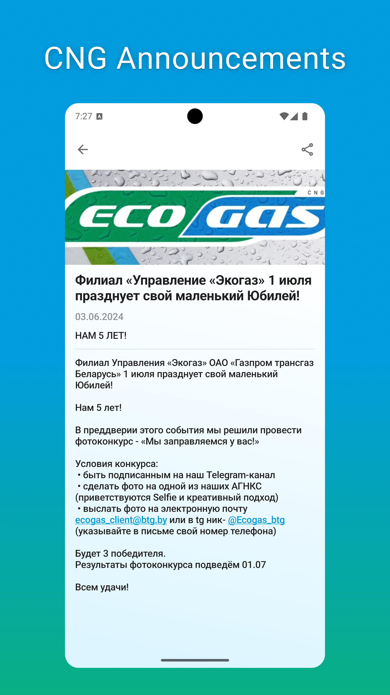
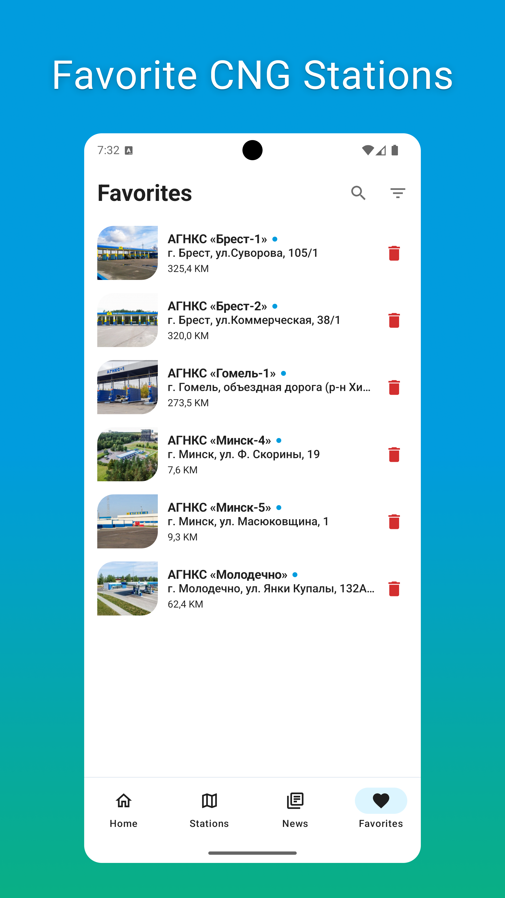

Metan Mobile
============

This is the repository for the [Metan Mobile](https://github.com/ngapp-dev/MetanMobile)
app. It is always updated and is under development.

**Metan Mobile** is a mobile application that helps owners of CNG vehicles quickly and conveniently find CNG gas stations in their area. With the app's handy map, users can find all CNG gas stations in their area and easily select the one that suits them. Thanks to the detailed information on the cards of gas stations, users can get acquainted with the opening hours, breaks, payment methods, as well as find out the price of natural gas, the distance to the CNG gas station and its workload during the day. In addition, the application offers users the ability to add their favorite gas stations to the Favorites section for quick further navigation within the application, getting the latest news about the CNG gas station and monitoring the status of the station.

The Metan Mobile application is published and actively maintained, with continuous improvements and regular updates to its libraries. The current version is [available on the Play Store](https://play.google.com/store/apps/details?id=com.ngapp.metanmobile).
The app is under constant development, gradually being covered with tests. Currently at the stage of implementation of screenshot testing, benchmarking, and setting up baseline profiles.
In the near future, we also plan to migrate to [Compose Multiplatform](https://github.com/JetBrains/compose-multiplatform) to develop an iOS version of the app.

# Features

**Metan Mobile** app performs its functions using data obtained from open sources. All rights to the application belong to [NGApps Dev](https://github.com/ngapp-dev).

The application architecture is based with respect to [Now in Android](https://developer.android.com/series/now-in-android) app.

📰 News, FAQ section and Calculators, Career in Metan Mobile app help users stay up to date with the latest developments in the industry, get answers to frequently asked questions, calculate the benefit in this type of fuel and find a job. You can share the latest information and information about the CNG gas station with other users so that they also keep up to date with the latest events. For those who need help or have further questions, the app provides contact information, including phone numbers and email addresses.

🗺️ With the app's nearest CNG gas station locator, users can quickly and easily find their nearest CNG gas station, making natural gas driving even more convenient. Metan Mobile is a useful application for anyone who prefers to use natural gas as a fuel and wants to fill their car in the most convenient and profitable way and always be aware of the latest news.

## Screenshots

  
  
  
  
  
  
  
  

## Libraries used
- 🧩 [Jetpack Compose](https://developer.android.com/jetpack/compose) - for UI
- 🌐 [Retrofit](https://square.github.io/retrofit/) - for networking
- 🗞️ [RSS-Parser](https://github.com/prof18/RSS-Parser) - for parsing RSS
- 📦 [Kotlinx Serialization](https://github.com/Kotlin/kotlinx.serialization) - for content negotiation
- 💉 [Hilt](https://dagger.dev/hilt/) - for dependency injection
- 🗃️ [Data Store](https://developer.android.com/jetpack/androidx/releases/datastore) - for storage
- 🛢️ [Room](https://developer.android.com/jetpack/androidx/releases/datastore) - for databasing
- 🏞️ [Coil](https://github.com/coil-kt/coil) - for loading images

## Services used
- 📊 [Firebase Analytics](https://github.com/firebase/firebase-android-sdk) - for analytics logging
- 🔎 [Firebase Crashlytics](https://github.com/firebase/firebase-android-sdk) - for crashlytics logging
- 📌 [Google Maps](https://developers.google.com/maps/documentation/android-sdk) - for Google Maps displaying
- 🔒 [Google UMP](https://developers.google.com/interactive-media-ads/docs/sdks/android/client-side/consent) - for showing consent screen
- 📢 [Google AdMob](https://developers.google.com/admob/android/sdk) - for showing ads
- 💳 [Google OSS](https://developers.google.com/android/guides/opensource) - for licensing

## Architecture

The Metan Mobile app follows the official architecture guidance which is described in detail in the [Now in Android app architecture learning journey](https://github.com/android/nowinandroid/blob/main/docs/ArchitectureLearningJourney.md).

In the Metan Mobile application, we utilize a [Gradle idiomatic approach](https://github.com/jjohannes/idiomatic-gradle) and a modularized architecture to enhance scalability and maintainability.
Data synchronization is efficiently handled in the background using [WorkManager](https://developer.android.com/develop/background-work/background-tasks/persistent/getting-started), ensuring seamless performance for users.

## UI
The app was designed using [Material 3 guidelines](https://m3.material.io/).

The Screens and UI elements are built entirely using [Jetpack Compose](https://developer.android.com/jetpack/compose).

Several custom elements, such as a gas station busy chart, calculators etc.

The app has theme modes, light and dark

## Author

This application was developed by [NGApps Dev](https://github.com/ngapp-dev). I am continuously working on improving the functionality, optimizing the app's performance, and keeping the libraries up-to-date to ensure its stability and relevance.

You can reach me at [ngapps.developer@gmail.com](mailto:ngapps.developer@gmail.com), and feel free to follow my projects on [GitHub](https://github.com/ngapp-dev).

I welcome contributions from the community! Whether it's suggestions, bug fixes, or new features, feel free to open an issue or submit a pull request. Thank you for using the app and for your support!
