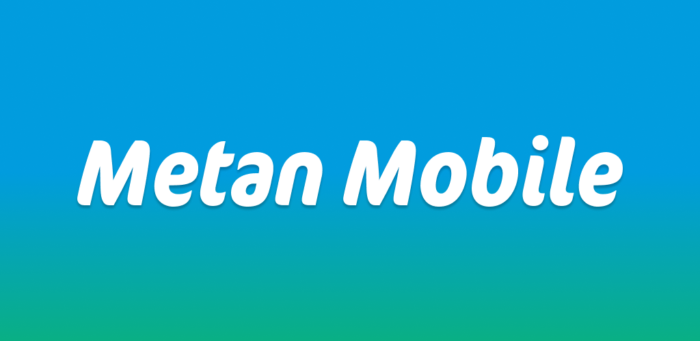
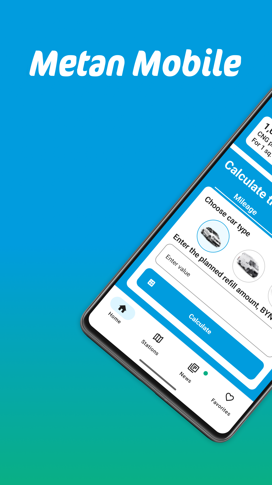
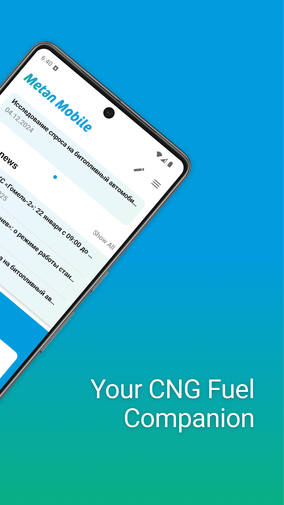
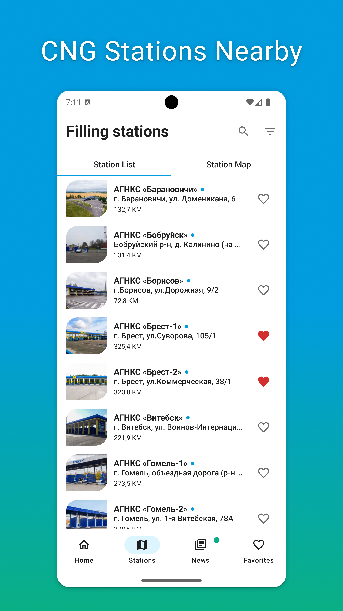
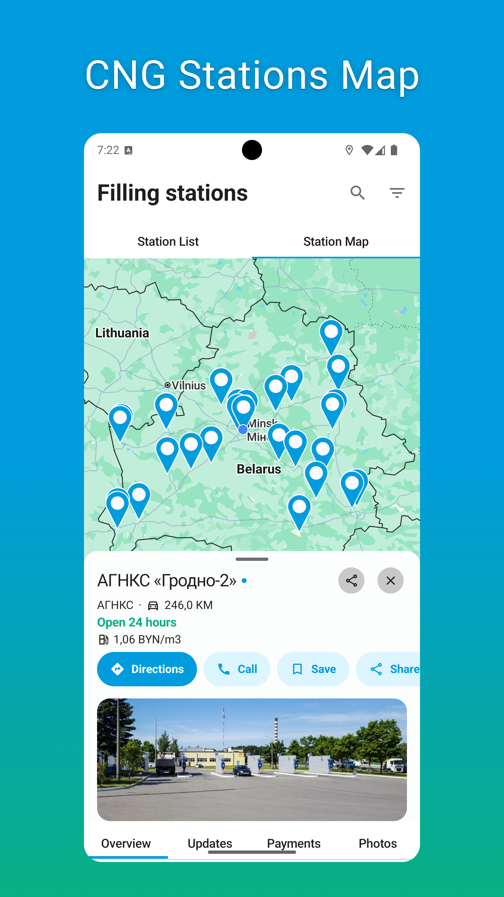
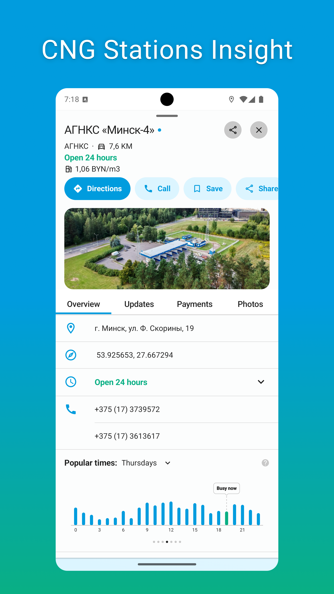
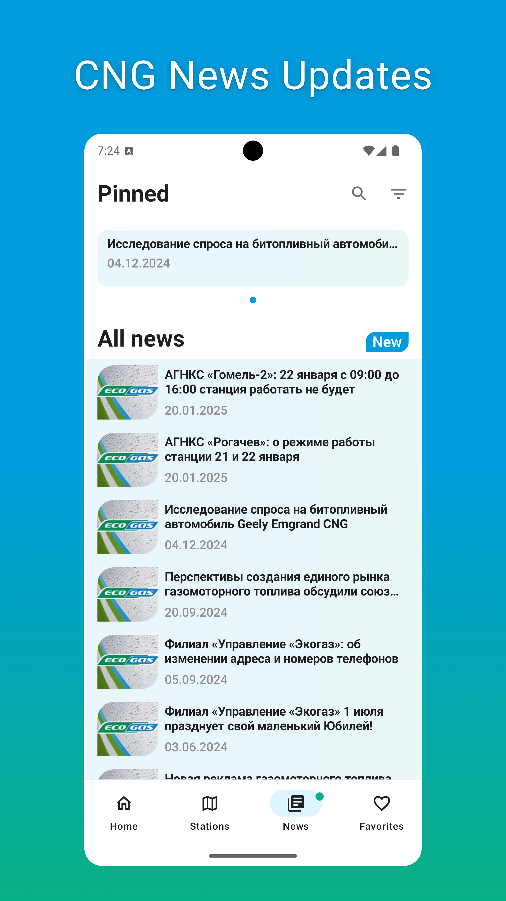
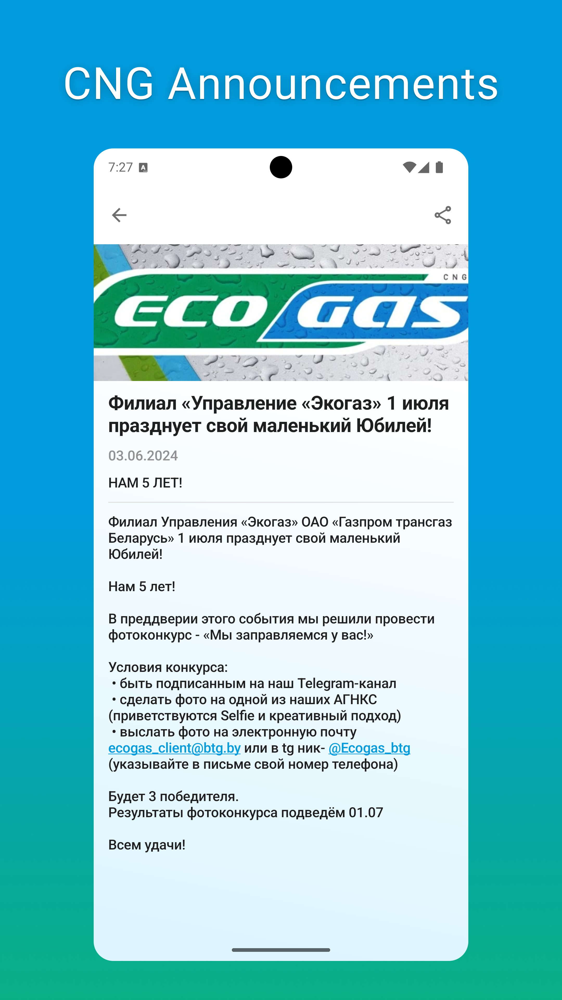
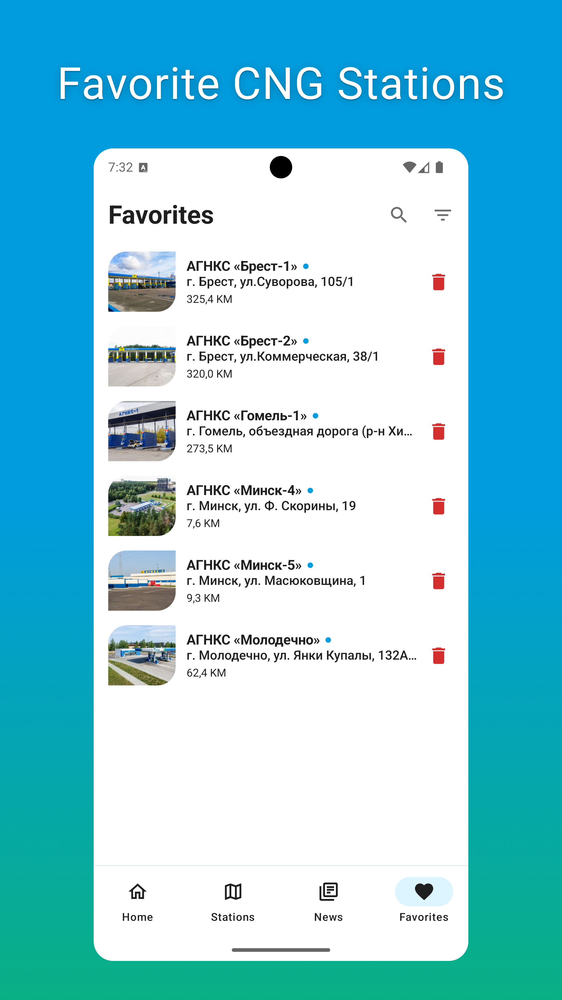

Metan Mobile
============

This is the repository for the [Metan Mobile](https://github.com/ngapp-dev/MetanMobile)
app. It is always updated and is under development.

**Metan Mobile** is a mobile application that helps owners of CNG vehicles quickly and conveniently find CNG gas stations in their area. With the app's handy map, users can find all CNG gas stations in their area and easily select the one that suits them. Thanks to the detailed information on the cards of gas stations, users can get acquainted with the opening hours, breaks, payment methods, as well as find out the price of natural gas, the distance to the CNG gas station and its workload during the day. In addition, the application offers users the ability to add their favorite gas stations to the Favorites section for quick further navigation within the application, getting the latest news about the CNG gas station and monitoring the status of the station.

The Metan Mobile application is published and actively maintained, with continuous improvements and regular updates to its libraries. The current version is [available on the Play Store](https://play.google.com/store/apps/details?id=com.ngapp.metanmobile).
The app is under constant development, gradually being covered with tests.

🚀 Starting with version **2.3.8**, Metan Mobile is a [Kotlin Multiplatform](https://kotlinlang.org/docs/multiplatform.html) app. The screens, ViewModels, navigation, data layer and design system are shared between **Android** and **iOS** with [Compose Multiplatform](https://github.com/JetBrains/compose-multiplatform). The iOS version is currently being prepared for release.

# Features

**Metan Mobile** app performs its functions using data obtained from open sources. All rights to the application belong to [NGApps Dev](https://github.com/ngapp-dev).

The application architecture started from the [Now in Android](https://developer.android.com/series/now-in-android) app and has since been adapted to Kotlin Multiplatform.

📰 News, FAQ section and Calculators, Career in Metan Mobile app help users stay up to date with the latest developments in the industry, get answers to frequently asked questions, calculate the benefit in this type of fuel and find a job. You can share the latest information and information about the CNG gas station with other users so that they also keep up to date with the latest events. For those who need help or have further questions, the app provides contact information, including phone numbers and email addresses.

🗺️ With the app's nearest CNG gas station locator, users can quickly and easily find their nearest CNG gas station, making natural gas driving even more convenient. Metan Mobile is a useful application for anyone who prefers to use natural gas as a fuel and wants to fill their car in the most convenient and profitable way and always be aware of the latest news.

## Screenshots

  
  
  
  
  
  
  
  

## Libraries used
- 🧬 [Kotlin Multiplatform](https://kotlinlang.org/docs/multiplatform.html) - for sharing code between Android and iOS
- 🧩 [Compose Multiplatform](https://github.com/JetBrains/compose-multiplatform) - for shared UI
- 🧭 [Navigation Compose](https://www.jetbrains.com/help/kotlin-multiplatform-dev/compose-navigation-routing.html) - for type-safe navigation
- ♻️ [Lifecycle ViewModel](https://www.jetbrains.com/help/kotlin-multiplatform-dev/compose-viewmodel.html) - for shared ViewModels
- 🌐 [Ktor](https://ktor.io/) - for networking
- 📦 [Kotlinx Serialization](https://github.com/Kotlin/kotlinx.serialization) - for content negotiation
- ⚡ [Kotlinx Coroutines](https://github.com/Kotlin/kotlinx.coroutines) - for asynchronous work
- 🕒 [Kotlinx Datetime](https://github.com/Kotlin/kotlinx-datetime) - for dates and time zones
- 💉 [Koin](https://insert-koin.io/) - for dependency injection
- 🗃️ [Data Store](https://developer.android.com/kotlin/multiplatform/datastore) + [Wire](https://github.com/square/wire) - for storing user preferences
- 🛢️ [Room](https://developer.android.com/kotlin/multiplatform/room) - for databasing
- 🏞️ [Coil 3](https://github.com/coil-kt/coil) - for loading images
- 🌍 [moko-resources](https://github.com/icerockdev/moko-resources) - for shared strings and images (English, Russian, Belarusian)
- 🫧 [Backdrop](https://github.com/Kyant0/AndroidLiquidGlass) - for the liquid glass effect
- 🔄 [WorkManager](https://developer.android.com/jetpack/androidx/releases/work) - for background sync on Android

## Services used
- 📊 [Firebase Analytics](https://github.com/firebase/firebase-android-sdk) - for analytics logging
- 🔎 [Firebase Crashlytics](https://github.com/firebase/firebase-android-sdk) - for crashlytics logging
- 📌 [Google Maps](https://developers.google.com/maps/documentation/android-sdk) - for displaying maps on Android
- 🍎 [MapKit](https://developer.apple.com/documentation/mapkit) - for displaying maps on iOS
- 🔒 [Google UMP](https://developers.google.com/admob/ump/android/quick-start) - for showing consent screen
- 📢 [Google AdMob](https://developers.google.com/admob) - for showing ads (Android and iOS)
- 📣 [Yandex Mobile Ads](https://ads.yandex.com/helpcenter/en/dev/android/quick-start) - for showing ads in Russia
- ☁️ [Cloudflare Workers](https://workers.cloudflare.com/) - Metan Mobile API backend
- 💳 [Google OSS](https://developers.google.com/android/guides/opensource) - for licensing

## Architecture

The Metan Mobile app started from the official architecture guidance described in the [Now in Android app architecture learning journey](https://github.com/android/nowinandroid/blob/main/docs/ArchitectureLearningJourney.md). It is now a Kotlin Multiplatform app built on the same ideas: a layered, offline-first architecture with unidirectional data flow. The libraries and the platform setup are different.

In the Metan Mobile application, we use a [Gradle idiomatic approach](https://github.com/jjohannes/idiomatic-gradle) with convention plugins and a modularized architecture to improve scalability and maintainability:
- 📱 `composeApp` - the shared application shell: theme, Koin modules and the navigation host
- 🤖 `app` - the Android application
- 🍏 `iosApp` - the iOS application (Xcode project) that hosts the shared Compose UI
- 🧱 `core:*` - shared KMP modules: data, domain, database, datastore, network, design system, UI components
- 🧩 `feature:*` - one KMP module per feature. Each module contains its UI, ViewModel, state and navigation in `commonMain`
- 🌍 `resources` - shared strings and images

Platform-specific code, such as maps, location, ads and background work, lives in `androidMain` and `iosMain` behind `expect`/`actual` declarations.

Data comes from the Metan Mobile API. The app downloads only the changes since the last sync and stores them in Room, so the app works offline. On Android, sync runs in the background with [WorkManager](https://developer.android.com/develop/background-work/background-tasks/persistent/getting-started).

## UI
The app was designed using [Material 3 guidelines](https://m3.material.io/).

The screens and UI elements are built entirely with [Compose Multiplatform](https://github.com/JetBrains/compose-multiplatform), so the same UI runs on Android and iOS.

The app has a floating liquid glass bottom navigation bar and glass top bars.

The app also has several custom elements, such as a gas station busy chart and calculators.

The app supports light and dark themes and three languages: English, Russian and Belarusian.

## Author

This application was developed by [NGApps Dev](https://github.com/ngapp-dev). I am continuously working on improving the functionality, optimizing the app's performance, and keeping the libraries up-to-date to ensure its stability and relevance.

You can reach me at [ngapps.developer@gmail.com](mailto:ngapps.developer@gmail.com), and feel free to follow my projects on [GitHub](https://github.com/ngapp-dev).

I welcome contributions from the community! Whether it's suggestions, bug fixes, or new features, feel free to open an issue or submit a pull request. Thank you for using the app and for your support!
